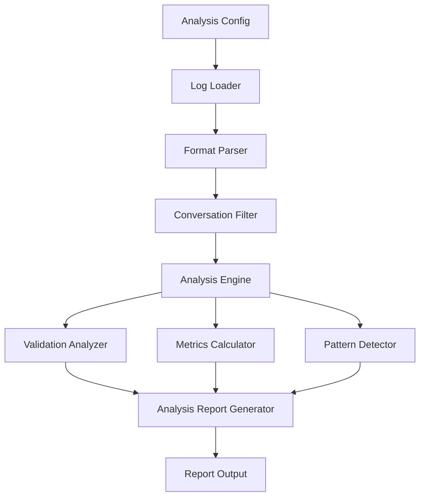

# Design Document: Chat Log Analysis

## Overview

The Chat Log Analysis feature provides a separate analysis pipeline for processing historical chat conversations without requiring live bot connections. This system parses various log formats, applies validation rules, generates metrics, and produces comprehensive analysis reports.

## Architecture

The analysis pipeline operates independently from the existing test execution system, with its own components for parsing, validation, and reporting.

### High-Level Component Diagram



## Components and Interfaces

### Log Loader

**Responsibility**: Load log files from disk and determine format

**Interface**:
```typescript
interface LogLoader {
  loadLog(path: string, format?: LogFormat): Promise<RawLogData>
  detectFormat(path: string): Promise<LogFormat>
  supportedFormats(): LogFormat[]
}

type LogFormat = 'json' | 'csv' | 'text' | 'auto';

interface RawLogData {
  content: string | object;
  format: LogFormat;
  metadata: {
    fileSize: number;
    lineCount?: number;
    encoding: string;
  };
}
```

### Format Parser

**Responsibility**: Parse raw log data into structured conversations

**Interface**:
```typescript
interface FormatParser {
  parse(data: RawLogData): Promise<ParsedConversation[]>
  validate(data: RawLogData): ValidationResult
}

interface ParsedConversation {
  id: string;
  messages: ConversationMessage[];
  metadata: {
    startTime?: Date;
    endTime?: Date;
    userId?: string;
    sessionId?: string;
    source?: string;
  };
}

interface ConversationMessage {
  sender: 'user' | 'bot';
  content: string;
  timestamp: Date;
  metadata?: Record<string, any>;
}

// Specific parsers
interface JsonLogParser extends FormatParser {
  // Parses JSON structured logs
}

interface CsvLogParser extends FormatParser {
  // Parses CSV tabular logs
}

interface TextLogParser extends FormatParser {
  // Parses plain text logs with patterns
}
```

### Conversation Filter

**Responsibility**: Filter conversations based on criteria

**Interface**:
```typescript
interface ConversationFilter {
  filter(
    conversations: ParsedConversation[],
    criteria: FilterCriteria
  ): ParsedConversation[]
}

interface FilterCriteria {
  dateRange?: {
    start: Date;
    end: Date;
  };
  minMessages?: number;
  maxMessages?: number;
  userIds?: string[];
  sessionIds?: string[];
  containsText?: string;
  customFilter?: (conv: ParsedConversation) => boolean;
}
```

### Analysis Engine

**Responsibility**: Orchestrate analysis of filtered conversations

**Interface**:
```typescript
interface AnalysisEngine {
  analyze(
    conversations: ParsedConversation[],
    config: AnalysisConfig
  ): Promise<AnalysisResults>
}

interface AnalysisConfig {
  validationRules?: ValidationCriteria[];
  calculateMetrics?: boolean;
  detectPatterns?: boolean;
  checkContextRetention?: boolean;
  streamingMode?: boolean;
}

interface AnalysisResults {
  summary: AnalysisSummary;
  validationResults: ConversationValidationResult[];
  metrics?: AnalysisMetrics;
  patterns?: DetectedPattern[];
  contextAnalysis?: ContextAnalysisResult[];
}
```

### Validation Analyzer

**Responsibility**: Apply validation rules to bot responses in conversations

**Interface**:
```typescript
interface ValidationAnalyzer {
  validateConversation(
    conversation: ParsedConversation,
    rules: ValidationCriteria[]
  ): ConversationValidationResult
}

interface ConversationValidationResult {
  conversationId: string;
  totalMessages: number;
  botMessages: number;
  validatedMessages: number;
  passedValidations: number;
  failedValidations: number;
  validationDetails: MessageValidationResult[];
}

interface MessageValidationResult {
  messageIndex: number;
  content: string;
  validationResults: ValidationResult[];
  overallPassed: boolean;
}
```

### Metrics Calculator

**Responsibility**: Calculate statistical metrics from conversations

**Interface**:
```typescript
interface MetricsCalculator {
  calculateMetrics(
    conversations: ParsedConversation[],
    validationResults: ConversationValidationResult[]
  ): AnalysisMetrics
}

interface AnalysisMetrics {
  totalConversations: number;
  totalMessages: number;
  averageMessagesPerConversation: number;
  averageConversationDuration?: number;
  validationPassRate: number;
  botResponseRate: number;
  timeDistribution?: {
    hourOfDay: Record<number, number>;
    dayOfWeek: Record<string, number>;
  };
  messageLengthStats: {
    min: number;
    max: number;
    average: number;
    median: number;
  };
}
```

### Pattern Detector

**Responsibility**: Identify common patterns in failures and conversations

**Interface**:
```typescript
interface PatternDetector {
  detectPatterns(
    conversations: ParsedConversation[],
    validationResults: ConversationValidationResult[]
  ): DetectedPattern[]
}

interface DetectedPattern {
  type: 'failure' | 'success' | 'anomaly';
  pattern: string;
  frequency: number;
  examples: string[];
  severity?: 'low' | 'medium' | 'high';
  description: string;
}
```

### Context Analyzer

**Responsibility**: Analyze context retention in multi-turn conversations

**Interface**:
```typescript
interface ContextAnalyzer {
  analyzeContext(
    conversation: ParsedConversation
  ): ContextAnalysisResult
}

interface ContextAnalysisResult {
  conversationId: string;
  hasMultipleTurns: boolean;
  contextRetentionScore: number;
  contextBreaks: ContextBreak[];
  overallQuality: 'poor' | 'fair' | 'good' | 'excellent';
}

interface ContextBreak {
  messageIndex: number;
  reason: string;
  severity: 'minor' | 'major';
}
```

### Analysis Report Generator

**Responsibility**: Generate reports from analysis results

**Interface**:
```typescript
interface AnalysisReportGenerator {
  generateReport(
    results: AnalysisResults,
    format: ReportFormat
  ): string
}

type ReportFormat = 'json' | 'html' | 'markdown' | 'csv';

interface AnalysisReport {
  timestamp: Date;
  summary: AnalysisSummary;
  metrics: AnalysisMetrics;
  patterns: DetectedPattern[];
  detailedResults: ConversationValidationResult[];
}

interface AnalysisSummary {
  totalConversations: number;
  analyzedConversations: number;
  filteredOut: number;
  overallPassRate: number;
  processingTime: number;
}
```

## Data Models

### Core Data Structures

```typescript
interface AnalysisConfiguration {
  logSource: {
    path: string;
    format: LogFormat;
  };
  filters?: FilterCriteria;
  validation?: {
    rules: ValidationCriteria[];
    stopOnFirstFailure?: boolean;
  };
  analysis: {
    calculateMetrics: boolean;
    detectPatterns: boolean;
    checkContextRetention: boolean;
  };
  reporting: {
    outputPath: string;
    formats: ReportFormat[];
    includeDetailedResults: boolean;
  };
  performance?: {
    streamingMode: boolean;
    batchSize?: number;
    maxMemoryMB?: number;
  };
}

interface StreamingProcessor {
  processInBatches(
    conversations: AsyncIterable<ParsedConversation>,
    batchSize: number,
    processor: (batch: ParsedConversation[]) => Promise<void>
  ): Promise<void>
}
```

## Log Format Specifications

### JSON Format

```json
{
  "conversations": [
    {
      "id": "conv-123",
      "userId": "user-456",
      "startTime": "2025-01-15T10:30:00Z",
      "endTime": "2025-01-15T10:35:00Z",
      "messages": [
        {
          "sender": "user",
          "content": "Hello",
          "timestamp": "2025-01-15T10:30:00Z"
        },
        {
          "sender": "bot",
          "content": "Hi there!",
          "timestamp": "2025-01-15T10:30:02Z"
        }
      ]
    }
  ]
}
```

### CSV Format

```csv
conversation_id,timestamp,sender,content,user_id
conv-123,2025-01-15T10:30:00Z,user,Hello,user-456
conv-123,2025-01-15T10:30:02Z,bot,Hi there!,user-456
conv-124,2025-01-15T11:00:00Z,user,Help me,user-789
```

### Text Format

```
=== Conversation: conv-123 ===
User ID: user-456
Start: 2025-01-15 10:30:00

[10:30:00] User: Hello
[10:30:02] Bot: Hi there!
[10:30:15] User: What's the weather?
[10:30:17] Bot: I can help with that...

=== End Conversation ===
```

## Correctness Properties

### Property 35: Log parsing completeness
*For any* valid log file in a supported format, parsing should extract all conversations without data loss.
**Validates: Requirements 1.1, 1.3**

### Property 36: Format detection accuracy
*For any* log file with a recognizable format, automatic format detection should correctly identify the format.
**Validates: Requirements 2.1, 2.2, 2.3**

### Property 37: Validation rule application
*For any* set of validation rules and parsed conversations, all rules should be applied to all bot messages.
**Validates: Requirements 3.1, 3.2, 3.3**

### Property 38: Filter criteria correctness
*For any* filter criteria, only conversations matching all criteria should be included in analysis.
**Validates: Requirements 4.1, 4.2, 4.3, 4.4**

### Property 39: Metrics calculation accuracy
*For any* set of analyzed conversations, calculated metrics should accurately reflect the data.
**Validates: Requirements 5.1, 5.2, 5.3**

### Property 40: Report format consistency
*For any* analysis results, reports in different formats should contain equivalent information.
**Validates: Requirements 6.1, 6.2, 6.3, 6.4**

### Property 41: Pattern detection consistency
*For any* set of similar failures, the pattern detector should group them together.
**Validates: Requirements 7.1, 7.2, 7.3**

### Property 42: Context analysis accuracy
*For any* multi-turn conversation, context retention analysis should correctly identify context references.
**Validates: Requirements 8.1, 8.2, 8.3**

### Property 43: Streaming mode memory bounds
*For any* large log file processed in streaming mode, memory usage should remain below configured limits.
**Validates: Requirements 9.1, 9.2, 9.3**

### Property 44: Configuration validation completeness
*For any* invalid analysis configuration, all errors should be reported with specific details.
**Validates: Requirements 10.1, 10.2, 10.3, 10.4**

## Error Handling

### Error Categories

1. **File Errors**: Missing files, permission issues, corrupted files
   - Strategy: Fail fast with clear error messages
   - Recovery: Provide file path and permission guidance

2. **Parse Errors**: Invalid format, malformed data, encoding issues
   - Strategy: Report line/position of error
   - Recovery: Suggest format corrections or alternative parsers

3. **Validation Errors**: Invalid rules, missing required fields
   - Strategy: Validate configuration before processing
   - Recovery: Provide examples of valid configurations

4. **Memory Errors**: File too large, insufficient memory
   - Strategy: Detect early and suggest streaming mode
   - Recovery: Provide batch processing options

5. **Analysis Errors**: Unexpected data patterns, calculation failures
   - Strategy: Continue with partial results
   - Recovery: Log errors and include in report

## Performance Considerations

### Streaming Mode

For large log files (>100MB or >10,000 conversations):
- Process conversations in batches
- Maintain bounded memory usage
- Provide progress updates
- Support cancellation

### Optimization Strategies

1. **Lazy Loading**: Load conversations on-demand
2. **Parallel Processing**: Analyze multiple conversations concurrently
3. **Caching**: Cache parsed conversations for repeated analysis
4. **Indexing**: Build indices for fast filtering

## CLI Integration

```bash
# Analyze a log file
patience analyze --log conversations.json --config analysis-config.json

# Quick analysis with inline rules
patience analyze --log chats.csv --format csv --validate-all

# Generate specific report format
patience analyze --log data.txt --format text --output-format html

# Stream large files
patience analyze --log huge.json --streaming --batch-size 100
```

## Integration with Existing System

The analysis pipeline is independent but can leverage:
- **ResponseValidator**: Reuse validation logic
- **ReportGenerator**: Extend for analysis reports
- **ValidationCriteria**: Same validation rule format
- **ContextManager**: Reuse context analysis logic

## File Structure

```
src/
├── analysis/
│   ├── AnalysisEngine.ts
│   ├── LogLoader.ts
│   ├── ConversationFilter.ts
│   ├── ValidationAnalyzer.ts
│   ├── MetricsCalculator.ts
│   ├── PatternDetector.ts
│   ├── ContextAnalyzer.ts
│   ├── AnalysisReportGenerator.ts
│   ├── StreamingProcessor.ts
│   └── parsers/
│       ├── FormatParser.ts
│       ├── JsonLogParser.ts
│       ├── CsvLogParser.ts
│       └── TextLogParser.ts
```

## Testing Strategy

### Unit Testing
- Test each parser with valid and invalid inputs
- Test filter logic with various criteria combinations
- Test metrics calculations with known datasets
- Test pattern detection with synthetic failure patterns

### Property-Based Testing
- Test all 10 correctness properties (35-44)
- Use fast-check to generate random log data
- Verify parsing round-trips
- Verify filter correctness

### Integration Testing
- Test end-to-end analysis pipeline
- Test with real-world log samples
- Test streaming mode with large files
- Test report generation in all formats

## Security Considerations

- **PII Protection**: Warn about sensitive data in logs
- **File Access**: Validate file paths to prevent directory traversal
- **Memory Limits**: Enforce limits to prevent DoS
- **Input Validation**: Sanitize all log content before processing
